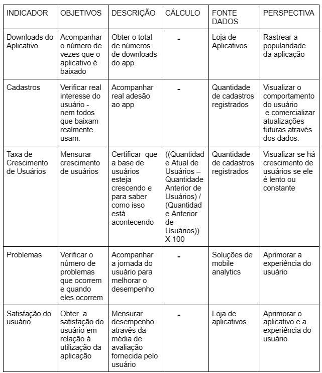
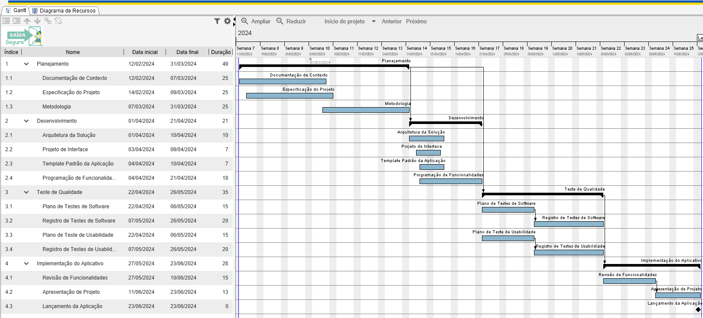
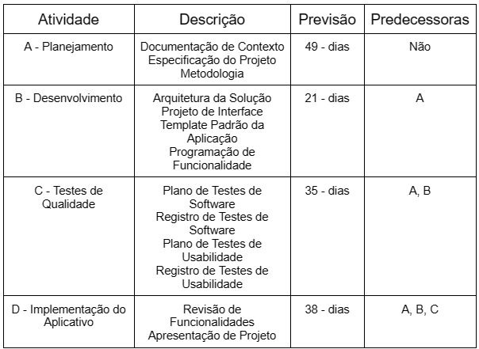
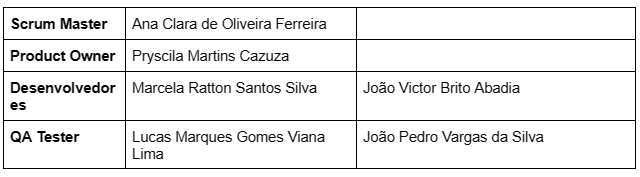

# Especificações do Projeto

## Personas

As personas levantadas durante o processo de entendimento do problema são apresentadas na Figuras que se seguem.

## Histórias de Usuários

Com base na análise das personas forma identificadas as seguintes histórias de usuários:

|EU COMO... `PERSONA`| QUERO/PRECISO ... `FUNCIONALIDADE` |PARA ... `MOTIVO/VALOR`                 |
|--------------------|------------------------------------|----------------------------------------|
|Umberto             | Certificar que seu filho está saindo com segurança da escola.           | Conseguir garantir o acesso por QR code à retirada do seu filho ao final do horário letivo.               |
|Marina              | Gerenciar quem vai buscar seus filhos na escola de forma segura e alinhada com a instituição de ensino.                 | Tornar flexível e confiável o alinhamento com a escola dos responsáveis que irão buscar seus filhos ao final do horário letivo quando for necessário alguma mudança. |
|Virgínia            | Garantir que sua filha não será liberada sem um adulto responsável e sem o seu aval.                 | Visualizar em tempo real  o status de saída da sua filha e o nome do responsável pela retirada da mesma. |
|Umberto             | Conseguir acompanhar a localização do seu filho até em casa.                 | Assegurar a localização atual do seu filho durante o trajeto de casa. |
|Marina              | Visualizar e manusear  com facilidade a aplicação.                 | Tornar uma boa experiência do usuário na utilização do app. |
|Virgínia            | Receber notificação sobre qualquer situação emergencial com sua filha.                 | Alertar sobre situações emergenciais de segurança em caso de eventual risco. |

## Modelagem do Processo de Negócio 

### Análise da Situação Atual

Apresente aqui os problemas existentes que viabilizam sua proposta. Apresente o modelo do sistema como ele funciona hoje. Caso sua proposta seja inovadora e não existam processos claramente definidos, apresente como as tarefas que o seu sistema pretende implementar são executadas atualmente, mesmo que não se utilize tecnologia computacional. 

### Descrição Geral da Proposta

Apresente aqui uma descrição da sua proposta abordando seus limites e suas ligações com as estratégias e objetivos do negócio. Apresente aqui as oportunidades de melhorias.

### Processo 1 – NOME DO PROCESSO

Apresente aqui o nome e as oportunidades de melhorias para o processo 1. Em seguida, apresente o modelo do processo 1, descrito no padrão BPMN. 

### Processo 2 – NOME DO PROCESSO

Apresente aqui o nome e as oportunidades de melhorias para o processo 2. Em seguida, apresente o modelo do processo 2, descrito no padrão BPMN.

## Indicadores de Desempenho

Apresente aqui os principais indicadores de desempenho e algumas metas para o processo. Atenção: as informações necessárias para gerar os indicadores devem estar contempladas no diagrama de classe. Colocar no mínimo 5 indicadores. 

Usar o seguinte modelo: 

## Requisitos

O escopo funcional do projeto é definido por meio dos requisitos funcionais que descrevem as possibilidades interação dos usuários, bem como os requisitos não funcionais que descrevem os aspectos que o sistema deverá apresentar de maneira geral. Estes requisitos são apresentados a seguir.

### Requisitos Funcionais

|ID    | Descrição do Requisito  | Prioridade |
|------|-----------------------------------------|----|
|RF-001| A aplicação deve apresentar um sistema de cadastro de usuários. | ALTA | 
|RF-002| A aplicação deve possuir perfis de usuário, Instituição de Ensino e usuário responsável.   | ALTA |
|RF-003| A aplicação deve armazenar informações de imagens correspondentes ao estudante e responsável, bem como dados pessoais.   | ALTA |
|RF-004| A aplicação deve permitir a inserção de dados de pessoas que tem autorização de buscar o aluno na escola, além dos pais.   | ALTA |
|RF-005| A aplicação deve permitir a criação de QR code para pessoas autorizadas a pegar a criança na escola.  | MÉDIA |
|RF-006| A aplicação deve emitir um alerta ao usuário Instituição de Ensino em casos de medidas protetivas.   | BAIXA |
|RF-007| A aplicação deve limitar a inclusão de contatos de emergência a apenas cinco por criança.   | MÉDIA |
|RF-008| O sistema deve permitir a edição de dados cadastrais.  | MÉDIA |

### Requisitos não Funcionais

|ID     | Descrição do Requisito  |Prioridade |
|-------|-------------------------|----|
|RNF-001| A aplicação deve ser publicada em um ambiente acessível expostas às publicações na Internet (Repl.it, GitHub Pages, Heroku). | ALTA | 
|RNF-002| A aplicação deve ser fácil de usar, com interface intuitiva. |  MÉDIA | 
|RNF-003| A aplicação deve ser acessível a partir de dispositivos móveis (tablets, celulares). |  ALTA | 
|RNF-004| A aplicação estar disponível 24 horas por dia, 7 dias por semana. |  BAIXA | 
|RNF-005| O sistema deve cumprir todas as leis e regulamentos aplicáveis. |  ALTA | 
|RNF-006| Deve processar requisições do usuário em no máximo 3s. |  BAIXA | 

## Restrições

O projeto está restrito pelos itens apresentados na tabela a seguir.

|ID| Restrição                                             |
|--|-------------------------------------------------------|
|01| O projeto deverá ser entregue até o dia 23/06 até às 23:59. |
|02| Não poderão ser contratados prestadores de serviços para desenvolvimento do projeto.        |
|03| O sistema deve ser mobile e interagir com o usuário.        |

## Diagrama de Casos de Uso

Na linguagem de modelagem unificada (UML), o diagrama de caso de uso resume os detalhes dos usuários do seu sistema (também conhecidos como atores) e as interações deles com o sistema.

O objetivo do diagrama de caso de uso em UML é demonstrar as diferentes maneiras que o usuário pode interagir com um sistema.

# Matriz de Rastreabilidade

É uma ferramenta utilizada com o intuito de facilitar a visualização dos relacionamentos dos requisitos, rastreando e  destacando suas especificações e seus diversos fatores são comparados entre si.
A matriz deve contemplar todos os elementos relevantes que fazem parte do sistema, conforme abaixo:

# Gerenciamento de Projeto

De acordo com o PMBoK v6 as dez áreas que constituem os pilares para gerenciar projetos, e que caracterizam a multidisciplinaridade envolvida, são: Integração, Escopo, Cronograma (Tempo), Custos, Qualidade, Recursos, Comunicações, Riscos, Aquisições, Partes Interessadas. Para desenvolver projetos um profissional deve se preocupar em gerenciar todas essas dez áreas. Elas se complementam e se relacionam, de tal forma que não se deve apenas examinar uma área de forma estanque. É preciso considerar, por exemplo, que as áreas de Escopo, Cronograma e Custos estão muito relacionadas. Assim, se eu amplio o escopo de um projeto eu posso afetar seu cronograma e seus custos.

## Gerenciamento de Tempo

Abaixo temos duas representações para o gerenciamento do projeto, levando em consideração todas as tarefas que devem ser entregues ao longo do eixo.

### Fluxo

O gráfico de Gantt ou diagrama de Gantt também é uma ferramenta visual utilizada para controlar e gerenciar o cronograma de atividades de um projeto. Com ele, é possível listar tudo que precisa ser feito para colocar o projeto em prática, dividir em atividades e estimar o tempo necessário para executá-las.

### Gráfico de Gantt ou diagrama de Gantt

Analise do Gráfico de Gantt:

## Gerenciamento de Equipe

O Gerenciamento de Equipes é o processo de acompanhar o desempenho de membros da equipe, fornecer feedback, resolver questões e gerenciar mudanças para otimizar o desempenho do projeto.

A equipe foi dividida em quatro principais papeis, sendo eles: Scrum Master, Product Owner, Desenvolvedores, QA Tester.

## Gestão de Orçamento

O processo de determinar o orçamento do projeto é uma tarefa que depende, além dos produtos (saídas) dos processos anteriores do gerenciamento de custos, também de produtos oferecidos por outros processos de gerenciamento, como o escopo e o tempo.

