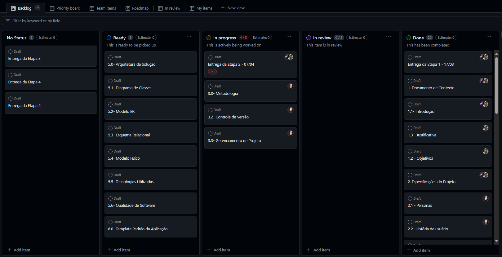
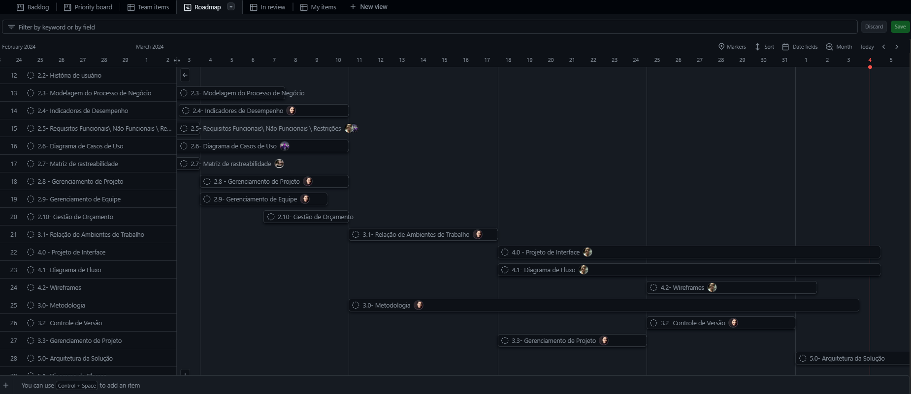

# Metodologia

Pré-requisitos: <a href="2-Especificação do Projeto.md"> Documentação de Especificação</a>

A metodologia utilizada pela equipe neste projeto contemplará a definição de ferramentas já inicialmente utilizadas e que utilizaremos no decorrer das próximas etapas, tanto para o desenvolvimento quanto para a manutenção ou organização do time na execução do projeto.

Utilizaremos o Git como o sistema de gerenciamento de código-fonte e também com o intuito de manter a documentação objetivando o aumento da capacidade de manutenção do produto.

Como ferramenta de gestão de equipe poderemos usar a ferramenta Trello e o Microsoft Teams.

## Relação de Ambientes de Trabalho
| Ambiente   | Plataforma  | Link de Acesso |
|------|-----------------------------------------|----|
| Repositório de Códico Fonte| GitHub | https://github.com/ICEI-PUC-Minas-PMV-ADS/ads-2024-1-e3-proj-mov-t5-saida-segura| 
| Documentação | GitHub | https://github.com/ICEI-PUC-Minas-PMV-ADS/ads-2024-1-e3-proj-mov-t5-saida-segura/tree/main/docs |
| Projeto de Interface e Wireframes | Figma e Lucid Chart  | https://www.figma.com/file/mWiNulUSDaZrinvmOnHPrv/Untitled?type=design&node-id=0%3A1&mode=design&t=VrRQa0S0Sl3GNb9w-1 e                                                                                      https://lucid.app/lucidchart/b213522d-75a4-46ff-af4c-e42f5b009a9a/edit?viewport_loc=-619%2C-111%2C2116%2C1166%2C0_0&invitationId=inv_2ef52add-be36-4caa-83a3-ad38971285aa |
| Gerenciamento do Projeto |  GitHub Project | https://github.com/orgs/ICEI-PUC-Minas-PMV-ADS/projects/924  |

## Controle de Versão

A ferramenta de controle de versão adotada no projeto foi o
[Git](https://git-scm.com/), sendo que o [Github](https://github.com)
foi utilizado para hospedagem do repositório.

O projeto segue a seguinte convenção para o nome de branches:

- `main`: versão estável já testada do software
- `develop`: versão de desenvolvimento do software
- `testing`: versão em testes do software

Quanto à gerência de issues, o projeto adota a seguinte convenção para
etiquetas:

- `documentation`: melhorias ou acréscimos à documentação
- `bug`: uma funcionalidade encontra-se com problemas
- `enhancement`: uma funcionalidade precisa ser melhorada
- `feature`: uma nova funcionalidade precisa ser introduzida

## Gerenciamento de Projeto

### Divisão de Papéis

Apresente a divisão de papéis entre os membros do grupo.

A equipe utiliza metodologias ágeis, tendo escolhido o Scrum como base para definição do processo de desenvolvimento. A equipe está organizada da seguinte maneira:

- Scrum Master: Ana Clara de Oliveira Ferreira
- Product Owner: Pryscila Martins Cazuza
- Equipe de Desenvolvimento: Marcela Ratton Santos Silva, João Vitor Brito Abadia
- QA Tester: VLucas Marques Gomes Viana Lima, João Pedro Vargas da Silva

### Processo

Como forma de organizar e desenvolver o projeto optamos por utilizar o Github Projects que  é uma ferramenta adaptável e flexível para planejar e acompanhar o trabalho no GitHub. 
Pode ser acessado através do link: https://github.com/orgs/ICEI-PUC-Minas-PMV-ADS/projects/924

| ETAPA (Sprint)  | DESCRITIVO ... (Detalhamento da etapa do processo)  | 
|------|---------------------------------------------------------------|
|PRODUCT BACKLOG:| formado por uma lista priorizada de atividades a serem desenvolvidas  |
| Ready | Pronto ou disponível para ser feito  |
| In Progress | Atividades em progresso, sendo desenvolvidas  |
| In Review |  Aguardando revisão ou assinatura  |
| Done |  Atividades feitas, terminadas    |

Figura 1 - kanban

Kanban é um sistema de controle e gestão do fluxo de produção.

Figura 2 - Roadmap

Roadmap é um roteiro, uma representação visual de uma estratégia. 
                      

### Ferramentas

As ferramentas empregadas no projeto são:

| Ferramenta (Solução Tecnologica) |Solução ... (Descrição das ferramentas utilizadas)  | 
|------|------------------------------------------------------------------------------|
| Editor de código: |  Visual Studio   |
| Ferramentas de comunicação: | Whatsapp, Discord e Teams  |
| Ferramentas de desenho de tela (_wireframing_):| Figma  |

