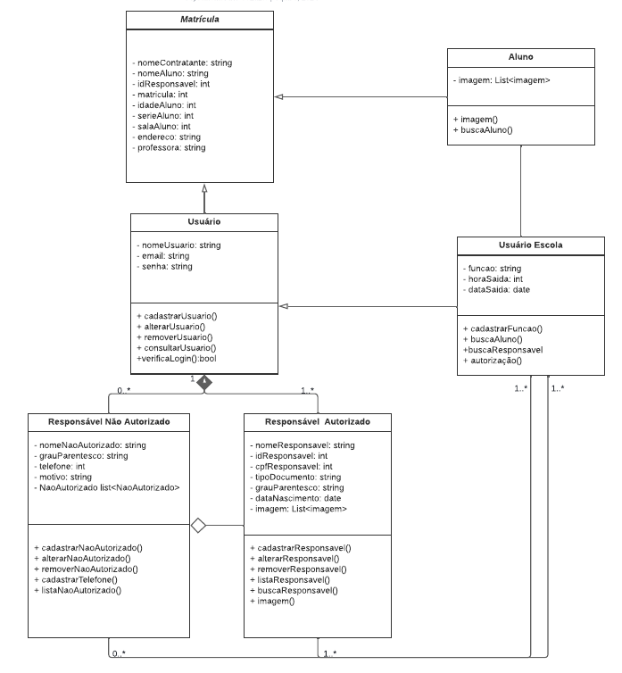
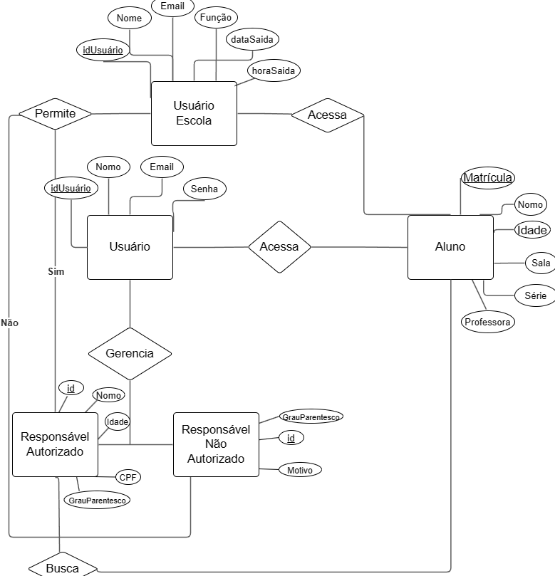
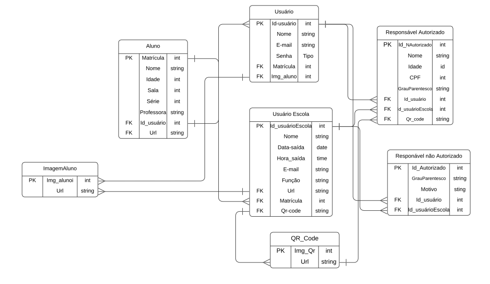

# Arquitetura da Solução

Pré-requisitos: <a href="3-Projeto de Interface.md"> Projeto de Interface</a>

Definição de como o software é estruturado em termos dos componentes que fazem parte da solução e do ambiente de hospedagem da aplicação.

## Diagrama de Classes

O diagrama de classes ilustra graficamente como será a estrutura do software, e como cada uma das classes da sua estrutura estarão interligadas. Essas classes servem de modelo para materializar os objetos que executarão na memória.

## Modelo ER

O Modelo ER representa através de um diagrama como as entidades (coisas, objetos) se relacionam entre si na aplicação interativa.]

## Esquema Relacional

O Esquema Relacional corresponde à representação dos dados em tabelas juntamente com as restrições de integridade e chave primária.
 

## Modelo Físico

Entregar um arquivo banco.sql contendo os scripts de criação das tabelas do banco de dados. Este arquivo deverá ser incluído dentro da pasta src\bd.

## Tecnologias Utilizadas

O projeto:

O projeto desenvolverá uma aplicação móvel a ser utilizada tanto para usuários de iOS quanto usuários de Android.

Linguagens de programação utilizadas e framework:

Javascript; 
React Native;

Repositório:

Utilizaremos o Github como versionador de código onde serão armazenadas as partes prontas do projeto e por possuir compatibilidade com o Visual Studio Code.

Gestão de Projeto:

O gerenciamento do projeto se dá a partir do Github Projects , por já ser uma ferramenta do Github, facilitando o acesso a todos os colaboradores, compartilhando, direcionando e realizando a gestão de tempo e das atividades.

IDE:

A IDE utilizada será o Visual Studio Code por ser um excelente editor de código aberto e possuir compatibilidade com o Visual Studio Code.

Banco de Dados:

Sistema gerenciador de banco de dados: SQLite, escolhido por sua boa integração com o editor de código e para facilitar a migração do banco de dados para o serviço de hospedagem nas fases mais avançadas do projeto.

## Hospedagem

Explique como a hospedagem e o lançamento da plataforma foi feita.

> **Links Úteis**:
>
> - [Website com GitHub Pages](https://pages.github.com/)
> - [Programação colaborativa com Repl.it](https://repl.it/)
> - [Getting Started with Heroku](https://devcenter.heroku.com/start)
> - [Publicando Seu Site No Heroku](http://pythonclub.com.br/publicando-seu-hello-world-no-heroku.html)

## Qualidade de Software

Conceituar qualidade de fato é uma tarefa complexa, mas ela pode ser vista como um método gerencial que através de procedimentos disseminados por toda a organização, busca garantir um produto final que satisfaça às expectativas dos stakeholders.

| **Subcaracterísticas de Qualidade de Software** | **Justificativa**                                                                                                                         | **Métrica**                                                                                                  |
| ----------------------------------------------- | ----------------------------------------------------------------------------------------------------------------------------------------- | ------------------------------------------------------------------------------------------------------------ |
| Funcionalidade                           | O software deve oferecer todas as funcionalidades necessárias para atender aos requisitos do projeto.                                    | Taxa de sucesso das operações realizadas no software.    |
| Usabilidade                      | O software deve ser intuitivo ao usuário de forma a facilitar e gerar ótima experiência de uso.    |   Utilização otimizada dos recursos do dispositivo , garantindo que performe de forma agil e eficiente. |
| Manutenibilidade                     |  Documentação alinhada com o projeto e o código deve ser bem estruturado, facilitando a leitura e manutenção de forma a realizar correções e atualizações do mesmo para novas versões. | Tempo médio de implementação uma nova funcionalidade, taxa de correção de erros|
| Estabilidade da execução de testes                  | identificar e avaliar quantas vezes um cenário de testes reprova por conta de defeitos no sistema | gera um insight de quais módulos do sistema são mais suscetíveis a falha no desenvolvimento de uma nova feature. |

